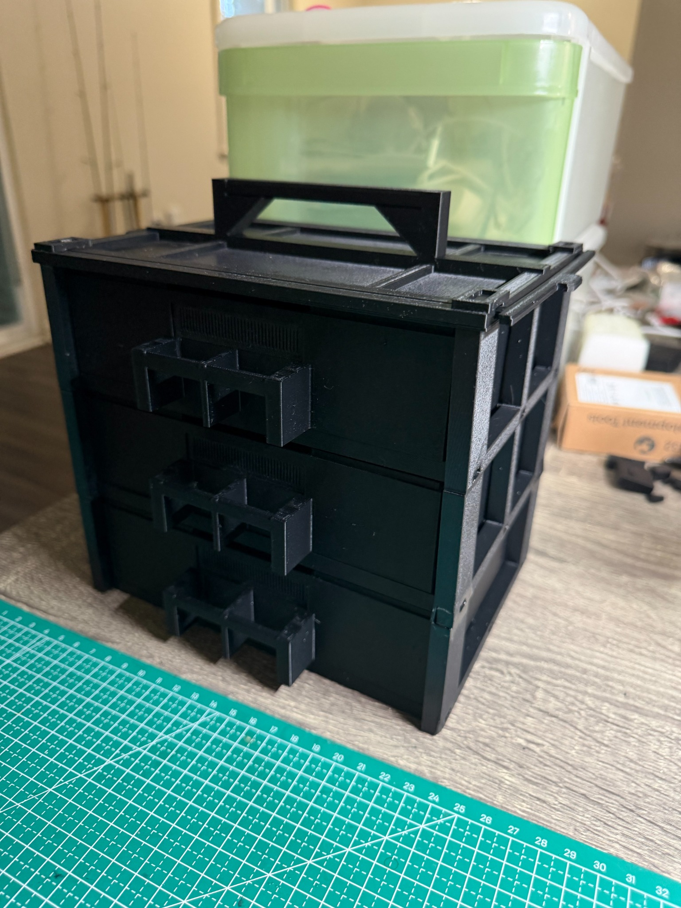

# Modular Mealworm Habitat

A 3D-printed drawer system for keeping a small mealworm colony in a compact, expandable setup.

## Why I Built It

I originally kept mealworms in ordinary food containers. They were convenient, but my ventilation arrangement prevented me from using their stacking features, so the containers occupied more desk space. Their transparent walls also left the insects visible to everyone nearby.

I designed an opaque, three-drawer habitat to separate beetles, small larvae, and larger larvae. Independently removable drawers provide access for routine care, while side vents allow the drawers to remain stacked. Replaceable vent inserts let me revise or replace a failed insert without reprinting the drawer.

## Scope and Status

V1 focuses on a usable basic habitat and a modular frame that can accept additional tiers. Printing time, material use, and structural optimization are planned for later iterations; sensing and automation are longer-term possibilities.

**The three-tier prototype is printed and assembled, and initial use has begun.** Parts were printed in PETG HF on a Bambu P1S with a 0.4 mm nozzle.

- Initial checks confirmed independent drawer access, vent fit, frame assembly, and manual cover installation and removal.
- Occasional drawer realignment remains. Containment, airflow, fourth-tier expansion, loaded carrying, and long-term durability still need verification.

The validation reports distinguish observed results from checks that remain open.

## Repository Guide

| File or folder | Contents |
| --- | --- |
| [Design requirements](design-requirements.md) | Product definition, requirement IDs, and verification criteria. |
| [Development logic](logic.md) | My design workflow and reflections. |
| [Working with AI](thoughts.md) | My experience using AI for test models, design changes, and iteration. |
| [Validation reports](doc/test-logs/) | Test parameters, observations, design decisions, and unresolved checks, linked to requirement IDs. |
| [Build guide](doc/build.md) | File quantities, printing notes, assembly, and the prototype configuration. |
| [CAD source](models/cad/) | Editable OpenSCAD models, organized by component. |
| [Current STL files](models/stl/current/) | Selected drawer, rack, cover, vent, and rear-stop models. |
| [Experimental STL files](models/stl/experiments/) | Fit coupons and earlier variants retained to document iteration. |
| [Photos](doc/images/) | Printed parts, assembly details, and the prototype. |

To review the project, start with the requirements, then the development logic and validation reports. To reproduce the parts, start with the build guide and current STL files.

## Authorship and License

I developed and tested this project with AI assistance for CAD generation and documentation. Requirements, design decisions, and physical evaluation were guided by my own use and observations.

A license has not yet been selected.
