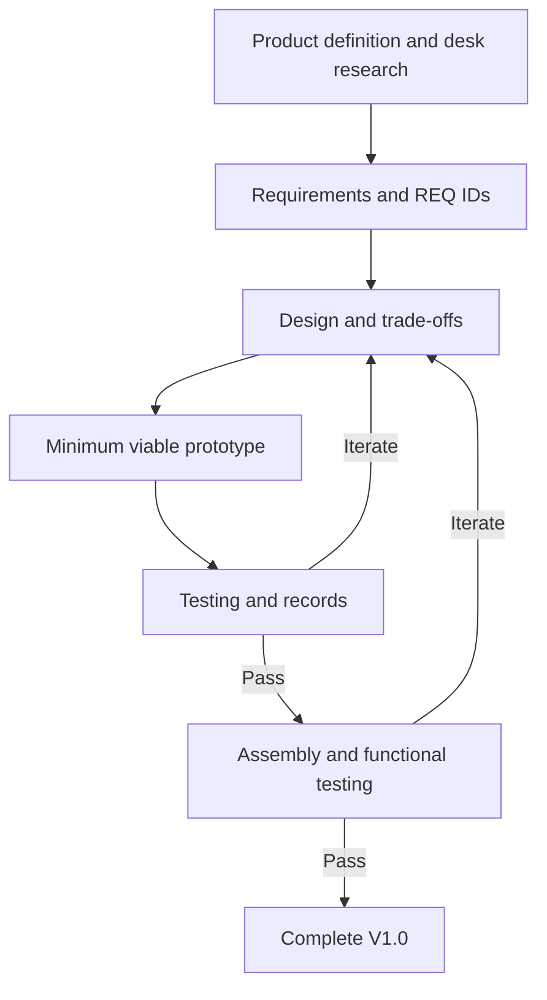

# Product Development Logic

My process starts with a practical need. I define the product, carry out desk research, and work through the requirements with small prototypes and repeated tests.

## Development Process

1. **Product definition and desk research.** I start with the problem I want to solve, look into existing approaches, and decide what the first version needs to do.

2. **Requirements and numbering.** I turn the product goals into requirements, assign REQ IDs, and define how to check them. The IDs connect related work; they do not determine the order of development.

3. **Design and trade-offs.** I compare possible solutions and consider what each adds in function, complexity, time, and cost before choosing an approach.

4. **Minimum viable prototyping.** I test key features before committing to a complete model. Each prototype answers a specific question and helps me decide the next step.

5. **Testing and iteration.** I record observations, data, and photos, modify the design, and test again. I update the records after each round. Assembly and functional testing check whether the parts work together and meet the requirements.

## Post-design Reflection

> [!NOTE]
> **What I want to improve next time**
>
> - **Set clearer test criteria.** I want to decide what counts as a pass before comparing designs.
> - **Check shared dimensions earlier.** I will check how each change affects the parts around it.
> - **Plan assembly checks.** I will make checking one assembled module a regular step before printing more copies.
> - **Give each revision a clear purpose.** I will state what I expect a change to improve, then check whether it does.
> - **Know when to stop.** I will finish the required functions for the current version and leave optional improvements for the next one.

**Reflection recorded:** 2026-09-29 23:25 EDT. **Revised:** 2026-09-29 23:47 EDT (UTC-04:00).
