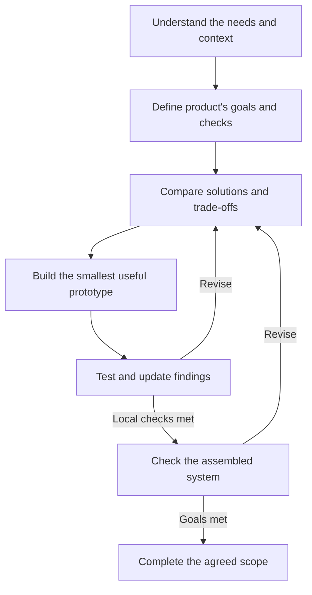

# Design Logic and Reflection

I approach development as a series of decisions supported by evidence. I begin with a practical need, define the intended outcome, and use small experiments to decide what to build next.

## My Design Approach

1. **Define the outcome before choosing the solution.** I translate the use problem into requirements and checks. This keeps a promising design idea accountable to the need it is meant to address.

2. **Make trade-offs explicit.** I compare what each approach enables with the complexity, effort, and uncertainty it introduces. The choice depends on the current scope and constraints.

3. **Match the prototype to the uncertainty.** I use the smallest implementation that can answer the current question, then examine interactions as parts come together. Confidence in one feature is a starting point for checking the system.

4. **Let findings guide the next decision.** Each iteration connects an observation to a reasoned change, a new check, and updated findings. I revise the solution when it misses a goal, and revisit the requirements when my understanding of the need changes.

## Post-design Reflection

> [!NOTE]
> **Improvements I want to carry into the next iteration**
>
> - **Clarify acceptance conditions earlier.** I will make comparisons less dependent on subjective impressions.
> - **Keep system constraints visible.** I will evaluate local changes against the dimensions and interactions they affect.
> - **Plan intermediate assembly checks.** I will make staged integration a deliberate checkpoint before repeating parts.
> - **State the expected effect of each change.** I will compare the result with that expectation before choosing the next revision.
> - **Define a stopping point.** I will complete the agreed scope and separate optional refinements from unresolved requirements.

**Reflection recorded:** 2026-09-20 13:06 EDT. **Revised:** 2026-09-29 23:38 EDT (UTC-04:00).
